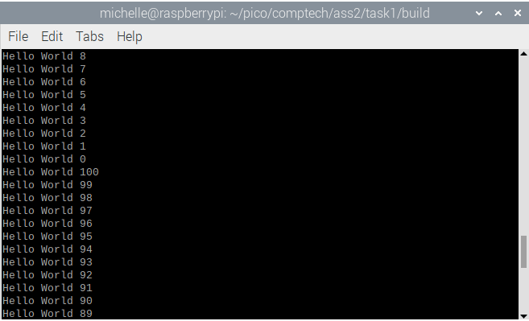

# 1DT301 Lab Assignment 2 - Introduction to RPi Pico
*Computer Technology 1* \
*October 5, 2025*

Author: Michelle Weber, Sanja Janevska\
Examiner: Mehdi Saman Azari\
Semester: HT25\
Discipline: NGDNS, NGDPV

# Tasks
## Task 1
- Download the source code for the Hello World program presented on page
24 in Stephen Smith’s book.
- Modify the program so that the counter starts at 100, decreases by one each
time the loop is repeated. Print the text Hello World followed by the counter
number. When the counter reaches 0, it shall be reset to 100 and start
decreasing again, in an infinite loop

### Explanation
For this task, minicom was used to display the output. The task was pretty straightforward.

The pre-written program already had needed variables assigned and a working code. So, all that was needed to do was to change it, so it counts from 100 to 0 with endless repetitions.\
The main program set the counter (Register 7) to 101. This way, the counter would be decremented to 100 before the print statement but it would then print from 100 downwards. Thats why 101 was stored in R7, instead of 100.\
The loop starts by storing the address "helloworld" of the string "Hello World %d\n" onto Register 0. It then decreases the counter (Register 7) by 1, moves that new value in Register 7 onto Register 1, and calls the print function. This function then prints the String "Hello World " combined with the value in Register 1 "%d" and a new line at the end "\n".\
Afterwards the value of Register 7 will be compared to 0 to see if the value is already at 0 and needs to be reset or not. If the value in Register 7 is not 0 yet, the loop will continue (start over) until it reaches 0. If the value is indeed 0, the "pointer" will be moved to the reset function, which then resets the value of Register 7 to 101, and sends you back to the top of the loop function.

### Execution
The program can be visible by using minicom. When the build file has been made and "cmake .." and "make" has been successfully executed inside the build file, you load the file onto the pico with "sudo picotool load HelloWorld.uf2" and then force-restart the pico with "sudo picotool reboot -f". It will then remove the pico as a data drive in your device and execute the program on the pico. Use the command "minicom -b 115200 -o -D /dev/ttyACM0" to open minicom and see the program's output.\
\
This whole program will loop forever, until you unplug the pico or press Ctrl A and then Z for help and choose X for "reset and exit".\
**Note:** This explanation of the commands was based on the Raspberry Pi 3 Model B V1.2 and *NOT* the virtual machine. However, the Raspberry had a similar OS than the VM. The Raspberry uses Bullseye 32-bit, so the commands *should* be the same (not tested).

### Sourcecode files
[HelloWorld.S](../ass2/task1/HelloWorld.S)\
[CMakeLists.txt](../ass2/task1/HelloWorld.S)\
[pico_sdk_import.cmake](../ass2/task1/pico_sdk_import.cmake)\
[HelloWorld.uf2](../ass2/task1/build/HelloWorld.uf2)

To get to the whole Task 1 directory instead, click [here](../ass2/task1/).

