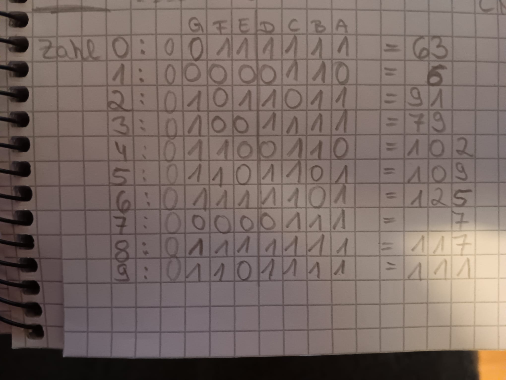

# 1DT301 Lab Assignment 2 - Introduction to RPi Pico
*Computer Technology 1* \
*October 5, 2025*

Author: Michelle Weber, Sanja Janevska\
Examiner: Mehdi Saman Azari\
Semester: HT25\
Discipline: NGDNS, NGDPV

# Tasks

# Task 1
- Download the source code for the Hello World program presented on page
24 in Stephen Smith’s book.
- Modify the program so that the counter starts at 100, decreases by one each
time the loop is repeated. Print the text Hello World followed by the counter
number. When the counter reaches 0, it shall be reset to 100 and start
decreasing again, in an infinite loop
- Compile and upload the program to the Pico. Open minicom, putty or a
similar terminal to show the result

## Explanation Code
For this task, minicom was used to display the output. The task was pretty straightforward.

The pre-written program already had needed variables assigned and a working code. So, all that was needed to do was to change it, so it counts from 100 to 0 with endless repetitions.\
The main program set the counter (Register 7) to 101. This way, the counter would be decremented to 100 before the print statement but it would then print from 100 downwards. Thats why 101 was stored in R7, instead of 100.\
The loop starts by storing the address "helloworld" of the string "Hello World %d\n" onto Register 0. It then decreases the counter (Register 7) by 1, moves that new value in Register 7 onto Register 1, and calls the print function. This function then prints the String "Hello World " combined with the value in Register 1 "%d" and a new line at the end "\n".\
Afterwards the value of Register 7 will be compared to 0 to see if the value is already at 0 and needs to be reset or not. If the value in Register 7 is not 0 yet, the loop will continue (start over) until it reaches 0. If the value is indeed 0, the "pointer" will be moved to the reset function, which then resets the value of Register 7 to 101, and sends you back to the top of the loop function.

## Execution
The program can be visible by using minicom. When the build file has been made and "cmake .." and "make" has been successfully executed inside the build file, you load the file onto the pico with "sudo picotool load HelloWorld.uf2" and then force-restart the pico with "sudo picotool reboot -f". It will then remove the pico as a data drive in your device and execute the program on the pico. Use the command "minicom -b 115200 -o -D /dev/ttyACM0" to open minicom and see the program's output.\
\
This whole program will loop forever, until you unplug the pico or press Ctrl A and then Z for help and choose X for "reset and exit".\
**Note:** This explanation of the commands was based on the Raspberry Pi 3 Model B V1.2 and *NOT* the virtual machine. However, the Raspberry had a similar OS than the VM. The Raspberry uses Bullseye 32-bit, so the commands *should* be the same (not tested).

## Sourcecode files
[HelloWorld.S](../ass2/task1/HelloWorld.S)\
[CMakeLists.txt](../ass2/task1/HelloWorld.S)\
[pico_sdk_import.cmake](../ass2/task1/pico_sdk_import.cmake)\
[HelloWorld.uf2](../ass2/task1/build/HelloWorld.uf2)

To get to the whole Task 1 directory instead, click [here](../ass2/task1/).

# Task 2
Connect one green, one yellow and one red light to three of the pins, in the same
order as a traffic light. Then, write a program to make them flash like a traffic light.\
Use pins GP0 for green, GP1 for yellow and GP2 for green LED! Also, make sure
you understand how to connect an LED and remember to ALWAYS connect it in
series to a resistor

You can use the code in Listing 8-1 (page 150). Copy everything from folder
Chapter 8/1/ and edit the .S file to write your own code!
Note: The functions link_gpio_put and link_gpio_set_dir are C functions, not
assembly, but you don’t need to care much about this, just remember to copy the
file sdklink.c!

## Explanation Code
We start off by defining 3 LEDs using .EQU LED_PIN followed by the number (for example LED_PIN1). We then use a comma in the same line to set the GP (pico output pin). So for example, LED 1 would be set on GP0 which would look something like this in Assembly: ".EQU	LED_PIN1, 0". Doing that with all 3 LEDS, and also setting the output to GPIO_OUT on 1, makes it now possible to integrate the pico pins in the program. We also set a pause timer for 200ms: ".EQU	sleep_time, 200	".\
The main code is to configure all LEDS. Each LED_PIN will be initialized, by using the pre-written gpio_init function that comes from the [sdklink.c](../ass2/task2/sdklink.c) file, that calls the original function in the gpio.h file. Next, the GPIO_OUT will be set as second variable (so, Register 1), while the LED_PIN will remain in Register 0 as first variable that will be handed down in the function "link_gpio_set_dir". This function configures the output pins that will be used.\
After all 3 LEDs have been initialized and configured, the loop will start. Here, the first LED will be turned on first, by setting it to 1 using the pre-written link_gpio_put function in the [sdklink.c](../ass2/task2/sdklink.c) file (that then calls the original function in the gpio.h file). After an LED is turned on, it will stay on for 200ms using the pre-written sleep_ms function. After 200ms have passed, the LED will be turned off again using the same procedure that was used to turn it on, only that to turn it off, value 0 will be used instead of 1.\
Each LED will be turned on once, glow for 200ms and will then be turned off. Since the task didnt specify, what Continent/Country the traffic lights refer to, the program uses the european version of it but simplified. So it will glow in the following order: green, yellow, red, yellow -> then repeat from start in endless loop. Traffic lights in the US use green -> yellow -> red -> green -> ... etc., and therefore skipping the yellow light. If that was, what the task was referring to, it could be easily changed in the [flashledssdk.S](../ass2/task2/flashledssdk.S) file by removing the last section where LED_PIN2 will be turned on and off again (Line 79 - 89).

The [sdklink.c](../ass2/task2/sdklink.c) file itself uses pre-written functions that are all handing down values to the original functions in the gpio.h file, which is inside the hardware file. To further understand the functions and the code, seeing those original functions in that file, was a little helpful. C isn't a language that was taught in any previous courses but even though the code in the gpio.h file was hard to even understand, the commenting was still explaining small portions of it, which helped immensely in utilizing those functions in later tasks (for example task 4).\
The path for the gpio.h file may differ from device to device but should be accessible through this path or similar:\
**/home/username/pico/pico-sdk/src/rp2_common/hardware_gpio/include/hardware/gpio.h**

## Hardware - How to use the right resisor
### Method 1 - Reading the colours on the resistor
The resistor has colour stripes on its' body, which tell you what resistance in OHM it has.\
If it has 4 rings, there is usally a space on the right side between the last ring and the other rings. Thats how you know where the end is and where to start reading. If there are 5, it sometimes may be hard to tell, but interpreting it both ways and also looking at its size and common right-sided colours, sometimes clears up the confusion.\
The image here shows 2 resistors. One with 4 rings and one with 5. It even shows you what colour each ring means and how each ring should be interpreted.\
Let's interpret the 4-ring resistor together:
- 1.Ring: brown = 1
- 2.Ring: black = 0
- 3.Ring: red   = x100 OHM
- 4.Ring: gold  = +/- 5% tolerance

So, we get: 10 * 100 OHM = 1000 OHM with +/- 5% tolerance which is exactly what the right corner next to the 4-ring resistor shows.\

### Method 2 - Using a multimeter
Before you measure: Make sure to start by putting the multimeter on the highest OHMs it has. Then, you measure and if nothing shows, you put the dial one level lower, measure again and so on, until you see something on the multimeter. This is to protect your multimeter from breaking or loosing accuracy (if it's analogue).

When it comes to putting which multimeter probe on what side, it didn't seem to change any of the results, even when flipping the multimeter probes. Just make sure not to touch the metal part when measuring. Otherwise, you might loose accuracy.\
The image below, shows the result of measuring my 330 OHM resistor with a low-end multimeter (119 SEK at BILTEMA). The result may have some tolerances but it was always somewhere near 330 OHM.\

## Hardware - How to know the direction of the LED
(LED = Light Emitting Diode)

### Method 1 - Don't PANIC
It is always helpful to have some Phrases, Puns or Acronyms or similar to remember which is cathode and which is anode. This image below is just one of many examples on how to remember which is which.
It is also helpful to remember that the long wire on the LED is the positive part (anode) and the short part of the LED is the negative part (catode).\

### Method 2 - Using a multimeter (Diodetest)
If you don't know which part is which, maybe because both wire parts have been cut to the same length or damaged etc., you can always rely on a multimeter.\
First you turn your multimeter' dial to the Diode Test like the [image](../ass2/images/Diodentest.jpg) below shows. Also, make sure to connect the black wire (multimeter probe) to the COM socket and the red wire (multimeter probe) into any socket that shows something like "V/OHM/mA" (thats at least for my multimeter).\
\
Next, you should hold both probes (metal ends of the wires) together to check if they work like in the [image](../ass2/images/DiodentestCheckFunktion.jpg) below. Most multimeters beep when doing so, and this is how you can check that everything works so far.\
\
Now, you hold either probe on one side and the other probe on the other side. The [image](../ass2/images/Diodentest_DiodeLeuchtet.jpg) below shows, that it was done correctly. This is proven by the LED glowing. The black probe represents the negative part and the red probe represents the positive part. Hence, the left wire of that LED is the cathode (negative) and the right wire is the anode (positive).\
\
It could also happen that the probes would be put onto the LED's wires the wrong way like in the [image](../ass2/images/Diodentest_DiodeLeuchtetNicht.jpg) below. If that happens, the LED wont glow, and you know that you should try to switch the sides and measure again. However, if even after switching, the LED won't glow, the LED could also be burned out (broken) or it was not measured correctly.

## Hardware - Layout
Note: I don't have green LEDs, so the cable colours will imitate the colours of the LEDs instead.

### Electric Circuit Plan
Note: The application didn't have Pico H, so I used the normal Pico instead. Pin connection should still be correct **where it was used**.\

## Execution
When the build file has been made and "cmake .." and "make" has been successfully executed inside the build file, you hold down the BOOTSEL button while plugging the pico into your device.Then, load the file onto the pico with "sudo picotool load FlashLEDsSDK.uf2" and then force-restart the pico with "sudo picotool reboot -f". It will then remove the pico as a data drive in your device and execute the program on the pico. Afterwards the LEDs should glow in the pattern: green -> yellow -> red -> yellow, and back to green in an infinite loop.

**Note:** This explanation of the commands was based on the Raspberry Pi 3 Model B V1.2 and *NOT* the virtual machine. However, the Raspberry had a similar OS than the VM. The Raspberry uses Bullseye 32-bit, so the commands *should* be the same (not tested).

## Sourcecode files
[flashledssdk.S](../ass2/task2/flashledssdk.S)\
[CMakeLists.txt](../ass2/task2/CMakeLists.txt)\
[pico_sdk_import.cmake](../ass2/task2/pico_sdk_import.cmake)\
[FlashLEDsSDK.uf2](../ass2/task2/build/FlashLEDsSDK.uf2)

To get to the whole Task 2 directory instead, click [here](../ass2/task2/).

# Task 3
Use the same setup as in Task 2 and create a binary conter that counts from 000 up
to 111. The picture below shows the first 4 steps. When the counter reaches its final
value 111, count back to 000 one step at a time, repeate infinitely. Make one second
delay between the counter values.

## Explanation Code
To get the 3 LEDs working for this task, it was easier to just copy the base setup of Task 2. Therefore, [sdklink.c](../ass2/task2/sdklink.c) and [flashledssdk.S](../ass2/task2/flashledssdk.S) was copied and reused for this task. Functions like link_gpio_put and link_gpio_set_dir were still used here afterall. The definition of the 3 LEDs (.EQU	LED_PINx, 0) was also reused. The main function also stayed the same, since we still need to initialize all LEDs again, just like last time. The rest of the program used a different code.\
After main, the program goes to the checkbits function, which checks each bit one by one and turns on the specific LEDs that are connected to a bit that is equal to 1. The [sdklink.c](../ass2/task3/sdklink.c) file now contains a new C function, that takes the counter variable stored in R7 as input (by moving it to R0) and another variable stored in R1, that represents the position of the bit that we want. The C function takes the binary value of the decimal value that was entered (counter that was originally from R7) and shifts the pointer to the desired position (second input of function; R1). It basically shifts "off" all non-relevant bits until it reaches the specific position, it then replaces all the other non-relevant values with 0 and only that one bit value remains, which will then be returned to the checkbits function in the assembly code. The value, that the bit holds will be put into the link_gpio_put function together with the corresponding LED. If the bit value was 1, that LED will then glow and if it was 0, the LED will turn off or remain off. \
The checkbits function will check all 3 bits, then pause for 1 second using sleep_ms. It will then redirect the program to either the backwards or forwards function, depending on the value in the loop flag stored in Register 6.\
The forwards function adds 0001 in binary (value 1 in decimal) and then compares the value to the binary value 0111. If the counter R7 has reached 0111, the function changeflagzero is called, which sets the value in Register 6 (loop flag) to 0, to signal to the checkbits function that it now has to send the program to the backwards function instead, when it reaches the end of its' program.\
The backwards function subtracts 0001 in binary (value 1 in decimal) and then compares the value to the binary value 0000. If the counter R7 has reached 0000, the function changeflagone is called, which sets the value in Register 6 (loop flag) to 1, to signal to the checkbits function that it now has to send the program to the forwards function instead, when it reaches the end of its' program.\
This will loop endlessly, as visible in the program, since there are no conditions set to end the program.

### The new C function "get_binary" in sdklink.c
Here is an example from the [testing_playground](../testing_playground/binary_values.c) to show how the function "get_binary" in [sdklink.c](../ass2/task3/sdklink.c) works:\

## Hardware Layout
Note: I don't have green LEDs, so the cable colours will imitate the colours of the LEDs instead.

### Electric Circuit Plan (same as task 2)
Note: The application didn't have Pico H, so I used the normal Pico instead. Pin connection should still be correct **where it was used**.\

## Execution
When the build file has been made and "cmake .." and "make" has been successfully executed inside the build file, you hold down the BOOTSEL button while plugging the pico into your device.Then, load the file onto the pico with "sudo picotool load FlashLEDsSDK.uf2" and then force-restart the pico with "sudo picotool reboot -f". It will then remove the pico as a data drive in your device and execute the program on the pico.\
The LEDs should now count up in binary from 0000 to 0111 and back to 0000 in an endless loop. Each LED represents 1 bit in the binary number. For this layout, the top LED represents the bit at position 0 (rightmost bit), the middle LED is representing the bit at position 1, and the bottom LED is representing the bit at position 2. It will only count to 0111, so only 3 LEDs are needed. Each counting demontration has a 1-second-pause inbetween.

**Note:** This explanation of the commands was based on the Raspberry Pi 3 Model B V1.2 and *NOT* the virtual machine. However, the Raspberry had a similar OS than the VM. The Raspberry uses Bullseye 32-bit, so the commands *should* be the same (not tested).

## Sourcecode files
[ledcountersdk.S](../ass2/task3/ledcountersdk.S)\
[CMakeLists.txt](../ass2/task3/CMakeLists.txt)\
[pico_sdk_import.cmake](../ass2/task3/pico_sdk_import.cmake)\
[LEDCounterSDK.uf2](../ass2/task3/build/LEDCounterSDK.uf2)

To get to the whole Task 3 directory instead, click [here](../ass2/task3/).

# Task 4
Connect a 7-segment display to the Pico. Implement a counter that counts from 0 up
to 9, then count back to 0, and repeats infinitely. Make a delay of 1 second between
the increments/decrements of the counter!\
Use pins GP0, GP1, …, GP6 for segments A, B, …, G, respectively!
Hint: If you want to set several GPIO ports using only one instruction, a C function
called gpio_put_all(…) can be useful!

## Explanation Code
To get the 7-segment Display working for this task, it was easier to just copy the base setup of Task 3. Therefore, [sdklink.c](../ass2/task3/sdklink.c) and [ledcountersdk.S](../ass2/task3/ledcountersdk.S) was copied and reused for this task. Functions like link_gpio_set_dir were still used here afterall. However, the function link_gpio_put was obsolete for this task, since gpio_put_all was used instead. Even in Task 3, gpio_put_all would have been a **much** better choice in terms of code improvement (shortening). The definition of the LEDs (.EQU	LED_PINx, 0) from task 3 was reused in a more expanded way. Now, there are 7 variables to define, since the task asks for the display's LEDs A to G (so without DP sadly). The main function is also quite similar, just a little more expanded to set all 7 LEDs of the display, instead of just 3 LEDs like in task 2 and 3.\
Some other functions were reused aswell, such as the forwards, backwards, chageflagzero (renamed) and changeflagone (renamed). The values for the counter in Register 7 was adjusted to the task and the checkbits function was replaced with the start function, but the value for the loop flag, that was stored in Register 6, remained.

After main, the program goes to the start function, which hands down the decimal value 10 to the C function [link_gpio_put_all](../ass2/images/gpio_put_all_function.PNG), which just calls gpio_put_all in the gpio.h file.\
The [link_gpio_put_all](../ass2/images/gpio_put_all_function.PNG) function has different cases. Each case value represents the value that should be shown on the display. Since value 0 is also a displayable value on the display, value 10 will be the case value for resetting every LED on the display. What is meant by resetting, is to put all pins to 0, resulting in all LEDs on the display turning off. This is to prevent any double displaying, resulting in the display showing mutiple numbers at once, and making it unreadable.\
gpio_put_all from the gpio.h file basically takes a 2 Byte value as input, so 8 bits. Since DP won't be used in this task, the last bit on the leftmost side will always remain 0. The other bits will be used to light up specific diodes on the display to make it a readable number. To know what bit and needs to be 1 and which bit needs to be 0, we can look at the image below. There, it is visible that diode A represents the first bit (rightmost bit) and the second bit is B and so on until we reach G, which is bit 7. Just like in Task 3, each bit will represent a LEDs status. 0 being "off" and 1 being "on". This is easier to understand, when you make notes prior to coding, like done here.\
 \
With the binary values written down for all digits from 0 to 9, the C function [link_gpio_put_all](../ass2/images/gpio_put_all_function.PNG) can be written. At the end, it would look something like this:\

Now, back to the program function after all diodes have been set to 0 using [link_gpio_put_all](../ass2/images/gpio_put_all_function.PNG), the counter variable from Register 7 will be moved to Register 0 to get handed down to the next call of [link_gpio_put_all](../ass2/images/gpio_put_all_function.PNG). This time, whatever value the counter had, will be displayed.\
Afterwards, the program will wait 1 second using sleep_ms. It will then redirect the program to either the backwards or forwards function, depending on the value in the loop flag stored in Register 6.\
The forwards function will increment the current counter (R7) by value 1 and then compares the value to the decimal value 9. If the counter R7 has reached value 9, the function changeflagtoone is called, which sets the value in Register 6 (loop flag) to 1, to signal to the start function that it now has to send the program to the backwards function instead, when it reaches the end of its' program.\
The backwards function decements the current counter (R7) by value 1 and then compares the value to the decimal value of 0. If the counter R7 has reached 0, the function changeflagtozero is called, which sets the value in Register 6 (loop flag) to 0, to signal to the start function that it now has to send the program to the forwards function instead, when it reaches the end of its' program.\
This will loop endlessly, as visible in the program, since there are no conditions set to end the program.

## Hardware - Finding out which pins are which - Finding common cathode/anode
Some of us lost the datasheet or just aren't sure which direction the current flows. In order not to accidentally break the 7 segment display, it can be tested using a much safer method. Such as using a multimeter. Use the same setup for the multimeter as in task 2. \
\
As previously in task 2, your black probe will be the negative and your red probe will the the positive part. It is adviced to put the black probe (negative part) on one pin and keeping it there while testing all the other pins on the display one by one with the red probe. If something glows, you write it down and move one further with the black probe and repeat the previously mentioned testing with the red probe on all other pins one by one.\
\
Here is the backside for a better understanding of how many pins and where the pins are.\
\
Once you have tested all pins or most of them, you should now know if your display uses common anode or common cathode. Depending on what display you use, your notes may vary but should look similar when it comes to the layout itself. Writing down what pin stands for what letter of the display and if it's a cathode or an anode.\
\
For this task, it is also helpful to write down what number needs what letters and what the pins on the display and the pico are for each letter.\

## Hardware Layout
Note: We were 2 people, but only had one 1 digit 7-segment display. Therefore, one of us was using their personal project for this task. **The Code is still the same and the wiring from A to G with the pico pins, is still done according to the task! There are just some additional pins on this display which are also connected to the pico but won't be used in this task and can therefore be ignored!**\

### Electric Circuit Plan
Note: The application didn't have Pico H, so I used the normal Pico instead. Pin connection should still be correct **where it matters**.\
If you connect common cathodes to a Pico output pins and leave them on LOW, the display will show something. This is used for multi-digit displays, when for example, displaying multiple digits at once (which isn't possible, so it's coded as an optical illusion to make it look like it can).\
The task's code and principle still stays the same.\

## Execution
When the build file has been made and "cmake .." and "make" has been successfully executed inside the build file, you hold down the BOOTSEL button while plugging the pico into your device.Then, load the file onto the pico with "sudo picotool load FlashLEDsSDK.uf2" and then force-restart the pico with "sudo picotool reboot -f". It will then remove the pico as a data drive in your device and execute the program on the pico.\
The 7 segment display should now count from 0 up to 9 and back to 0 in an endless loop. Each diode on the display represents 1 bit in the binary number that is used in the [link_gpio_put_all](../ass2/images/gpio_put_all_function.PNG) function. Each counting demontration has a 1-second-pause inbetween.

**Note:** This explanation of the commands was based on the Raspberry Pi 3 Model B V1.2 and *NOT* the virtual machine. However, the Raspberry had a similar OS than the VM. The Raspberry uses Bullseye 32-bit, so the commands *should* be the same (not tested).

## Sourcecode files
[DisplayCounterSDK.S](../ass2/task4/DisplayCounterSDK.S)\
[CMakeLists.txt](../ass2/task4/CMakeLists.txt)\
[pico_sdk_import.cmake](../ass2/task4/pico_sdk_import.cmake)\
[DisplayCounterSDK.uf2](../ass2/task4/build/DisplayCounterSDK.uf2)

To get to the whole Task 4 directory instead, click [here](../ass2/task4/).

---
# Sources
## Images that weren't taken by ourselves
https://www.elektronik-kompendium.de/sites/bau/1109051.htm \
https://files.schudio.com/bishop-challoner-catholic-college/files/documents/Yr10-Chemistry-10Y3-Miss_Mayor-Week_5-4th_May-Products_of_Electrolysis.pdf \
https://chemistry.stackexchange.com/questions/68533/which-is-anode-and-which-is-cathode

## Pico Pinout
https://pico2.pinout.xyz/ \
https://datasheets.raspberrypi.com/pico/Pico-R3-A4-Pinout.pdf

## 7 Segment Display
**Note:** Some of those links refer to/contain information about 4 digit displays. This is because each group only got 1 One digit display and we were 2 people. One of us already had a 4 digit display at home, while the other was able to use the given one by the school.\
https://forum.digikey.com/t/checking-7-segment-display/750?utm_source=chatgpt.com \
https://soldered.com/productdata/2015/09/Soldered_LD3361BS_datasheet.pdf?srsltid=AfmBOoq0jtcJOlz52ymj_aYuQtiQMwl3hg2E0N3lksU43k0632qJvjb5 \
https://www.xlitx.com/7-segment-led-dot-matrix/2841as.html \
https://www.xlitx.com/7-segment-led-dot-matrix/2841as.html \
https://www.youtube.com/watch?v=7Y_uvV22_X0&list=WL&index=2&t=366s \
https://www.youtube.com/watch?v=V5S8Vvrn6cY \
https://www.youtube.com/watch?v=qE5ycgqswGY \
https://www.youtube.com/watch?v=fYAlE1u5rno \
https://www.youtube.com/watch?v=5d-dtMyqUpc

## Pico Instructions
https://developer.arm.com/documentation/dui0473/m/arm-and-thumb-instructions/arm-and-thumb-instruction-summary \
https://github.com/Apress/RP2040-Assembly-Language-Programming/tree/main \
https://datasheets.raspberrypi.com/pico/getting-started-with-pico.pdf

## C coding
https://stackoverflow.com/questions/55330597/how-do-i-execute-a-c-file \
https://www.geeksforgeeks.org/c/c-switch-statement/ \
https://www.youtube.com/watch?v=ciio80nkjB8&list=WL&index=12&t=240s

## For general studying / Other
https://www.raspberrypi.com/documentation/computers/getting-started.html \
https://www.raspberrypi.com/documentation/microcontrollers/c_sdk.html \
https://studio2.org.uk/jack/RP2040%20Assembly%20Language%20Programming%20%28Smith%29.pdf \
https://projects.raspberrypi.org/en/projects/getting-started-with-the-pico \
https://www.circuit-diagram.org/editor/
