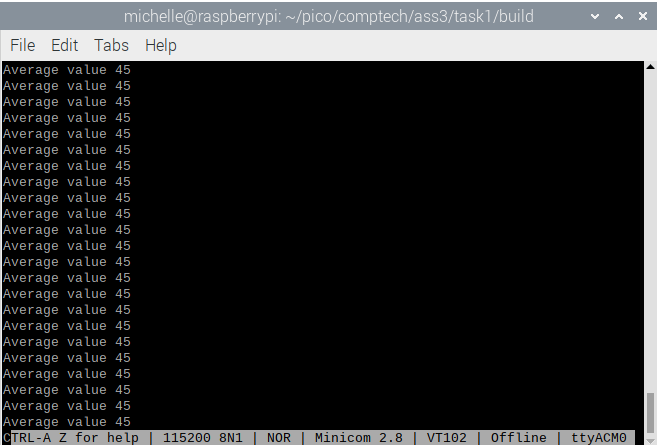
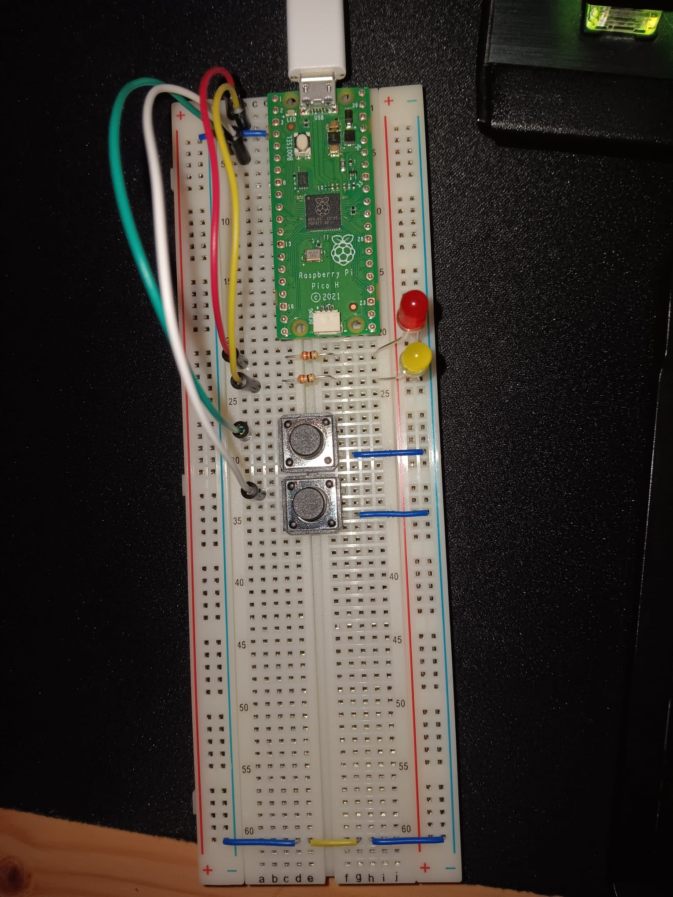
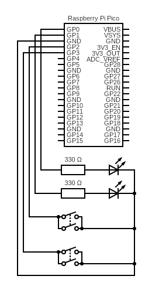
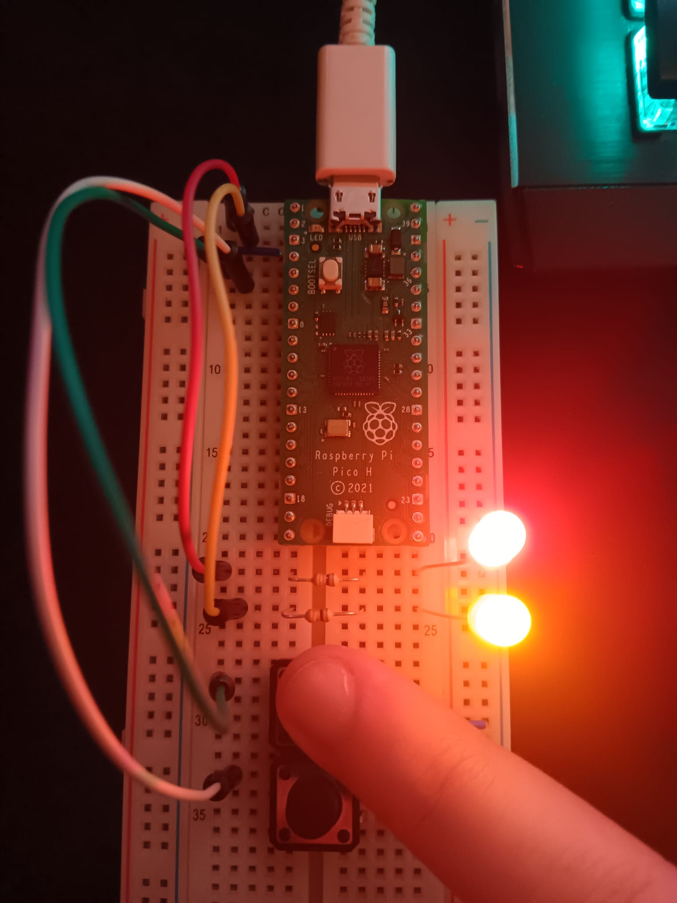
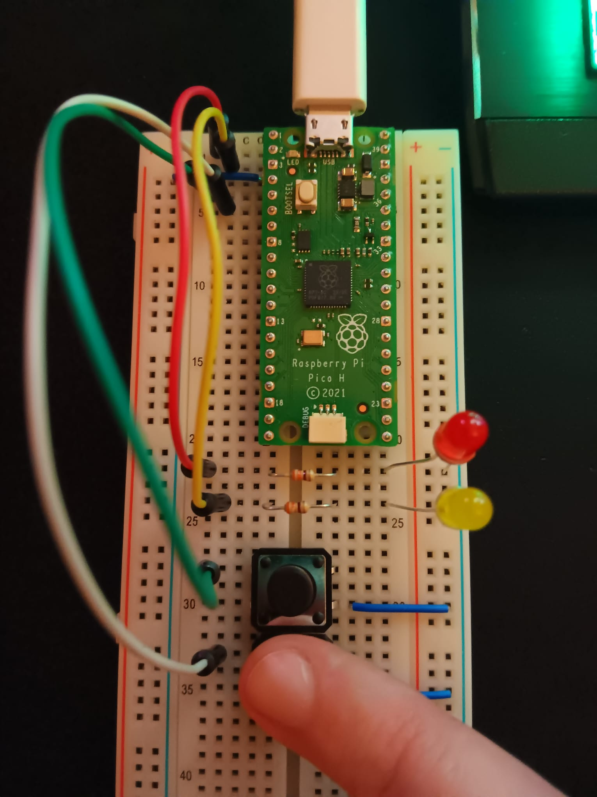

# 1DT301 Lab Assignment 3
*Computer Technology 1* \
*October 21, 2025*

Author: Michelle Weber, Sanja Janevska\
Examiner: Mehdi Saman Azari\
Semester: HT25\
Discipline: NGDNS, NGDPV

# Tasks

# Task 1
Write a program to calculate the average value of 8 numbers defined in the .data section. Then, show the result in the terminal (i.e. Minicom). You can use the code as a template (see [Tasksheet](../ass3/Lab%203%20-%20Subroutines%20and%20inputs.pdf)).\
To show the result, the easiest way is probably to write the result continuously in an infinte loop, as in the Hello World program.

## Explanation Code
For this task, minicom was used to display the output.
// TODO

## Execution
// TODO
The program can be visible by using minicom. When the build file has been made and "cmake .." and "make" has been successfully executed inside the build file, you load the file onto the pico with "sudo picotool load HelloWorld.uf2" and then force-restart the pico with "sudo picotool reboot -f". It will then remove the pico as a data drive in your device and execute the program on the pico. Use the command "minicom -b 115200 -o -D /dev/ttyACM0" to open minicom and see the program's output.\
\
This whole program will loop forever, until you unplug the pico or press Ctrl A and then Z for help and choose X for "reset and exit".\
**Note:** This explanation of the commands was based on the Raspberry Pi 3 Model B V1.2 and *NOT* the virtual machine. However, the Raspberry had a similar OS than the VM. The Raspberry uses Bullseye 32-bit, so the commands *should* be the same (not tested).

## Sourcecode files
[AverageArrayValue.S](../ass3/task1/v1/AverageArrayValue.S)\
[CMakeLists.txt](../ass3/task1/v1/CMakeLists.txt)\
[pico_sdk_import.cmake](../ass3/task1/v1/pico_sdk_import.cmake)\
[AverageValue.uf2](../ass3/task1/v1/build/AverageArrayValue.uf2)

To get to the whole Task 1 directory instead, click [here](../ass3/task1/).

# Task 2
Connect two LEDs to GP0+GP1 and two pushbuttons: One connected to GP2 and one to GP3. First, you must find out how to connect the push button and how to set up the pin to read if it is pushed down or not!\
Then, write a program with the following functionality:\
If push button on GP1 is pushed down, turn on both LEDs. If push button on GP2 is pushed down, turn off both LEDs. Ignore the case when both buttons are down!\
In this task, you must use a C function to read the pin!

## Explanation Code
// TODO

## Hardware - Layout

### Electric Circuit Plan
Note: The application didn't have Pico H, so I used the normal Pico instead. Pin connection should still be correct **where it was used**.\

## Execution
When the build file has been made and "cmake .." and "make" has been successfully executed inside the build file, you hold down the BOOTSEL button while plugging the pico into your device.Then, load the file onto the pico with "sudo picotool load SimpleButtonsOneSDK.uf2" and then force-restart the pico with "sudo picotool reboot -f". It will then remove the pico as a data drive in your device and execute the program on the pico.\
If you now press the first button, both LEDs should light up (see image below).\
\
If you then press the second button, both LEDs should turn off (see image below).\

The buttons can be pressed as many times as the user wants, since the code runs in an endless loop. Just like the task required, the case where both buttons are pressed, will be ignored.

**Note:** This explanation of the commands was based on the Raspberry Pi 3 Model B V1.2 and *NOT* the virtual machine. However, the Raspberry had a similar OS than the VM. The Raspberry uses Bullseye 32-bit, so the commands *should* be the same (not tested).

## Sourcecode files
[SimpleButtonsOneSDK.S](../ass3/task2/SimpleButtonsOneSDK.S)\
[CMakeLists.txt](../ass3/task2/CMakeLists.txt)\
[pico_sdk_import.cmake](../ass3/task2/pico_sdk_import.cmake)\
[SimpleButtonsOneSDK.uf2](../ass3/task2/build/SimpleButtonsOneSDK.uf2)

To get to the whole Task 2 directory instead, click [here](../ass3/task2/).

# Task 3
Use the same hardware setup as in Task 2.\
This time, you are not allowed to use C functions to read from the input pin or to turn the LEDs on/off! You must use read and write instructions to and from hardware registers. You can use the example from the book, chapter 9.\
You are allowed to use C functions to initialize and set direction, like in the program listing 8-1 in the book. Alternatively, you can use the gpioinit function in Listing 9-5 to initialize the pins.

## Explanation Code
// TODO

### The new C function "get_binary" in sdklink.c
// TODO

## Hardware Layout
// TODO

### Electric Circuit Plan
Note: The application didn't have Pico H, so I used the normal Pico instead. Pin connection should still be correct **where it was used**.\
(same as task 2)\

## Execution
// TODO

**Note:** This explanation of the commands was based on the Raspberry Pi 3 Model B V1.2 and *NOT* the virtual machine. However, the Raspberry had a similar OS than the VM. The Raspberry uses Bullseye 32-bit, so the commands *should* be the same (not tested).

## Sourcecode files
// TODO
[SimpleButtonsTwoSDK.S](../ass3/task3/SimpleButtonsTwoSDK.S)\
[CMakeLists.txt](../ass3/task3/CMakeLists.txt)\
[pico_sdk_import.cmake](../ass3/task3/pico_sdk_import.cmake)\
[SimpleButtonsTwoSDK.uf2](../ass3/task3/build/SimpleButtonsTwoSDK.uf2)

To get to the whole Task 3 directory instead, click [here](../ass3/task3/).

---
# Sources
## Images that weren't taken by ourselves

## Pico Pinout
https://pico2.pinout.xyz/ \
https://datasheets.raspberrypi.com/pico/Pico-R3-A4-Pinout.pdf

## Pico Instructions
https://developer.arm.com/documentation/dui0473/m/arm-and-thumb-instructions/arm-and-thumb-instruction-summary \
https://github.com/Apress/RP2040-Assembly-Language-Programming/tree/main \
https://datasheets.raspberrypi.com/pico/getting-started-with-pico.pdf

## C coding
https://stackoverflow.com/questions/55330597/how-do-i-execute-a-c-file \
https://www.geeksforgeeks.org/c/c-switch-statement/ \
https://www.youtube.com/watch?v=ciio80nkjB8&list=WL&index=12&t=240s

## For general studying / Other
https://www.raspberrypi.com/documentation/computers/getting-started.html \
https://www.raspberrypi.com/documentation/microcontrollers/c_sdk.html \
https://studio2.org.uk/jack/RP2040%20Assembly%20Language%20Programming%20%28Smith%29.pdf \
https://projects.raspberrypi.org/en/projects/getting-started-with-the-pico \
https://www.circuit-diagram.org/editor/
