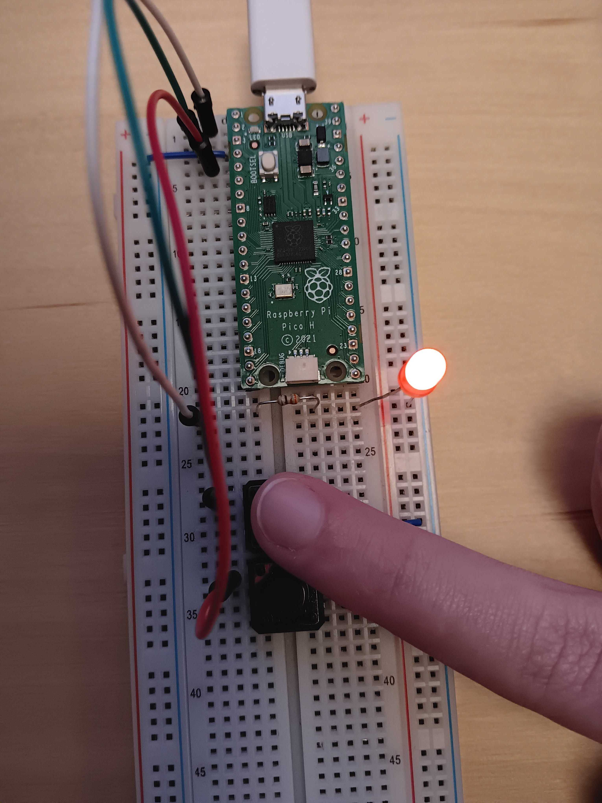
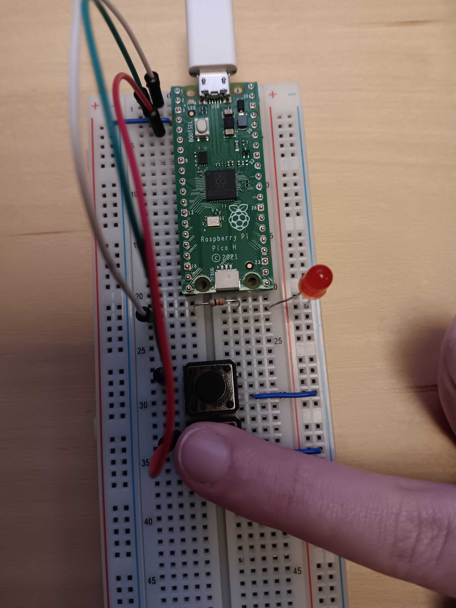
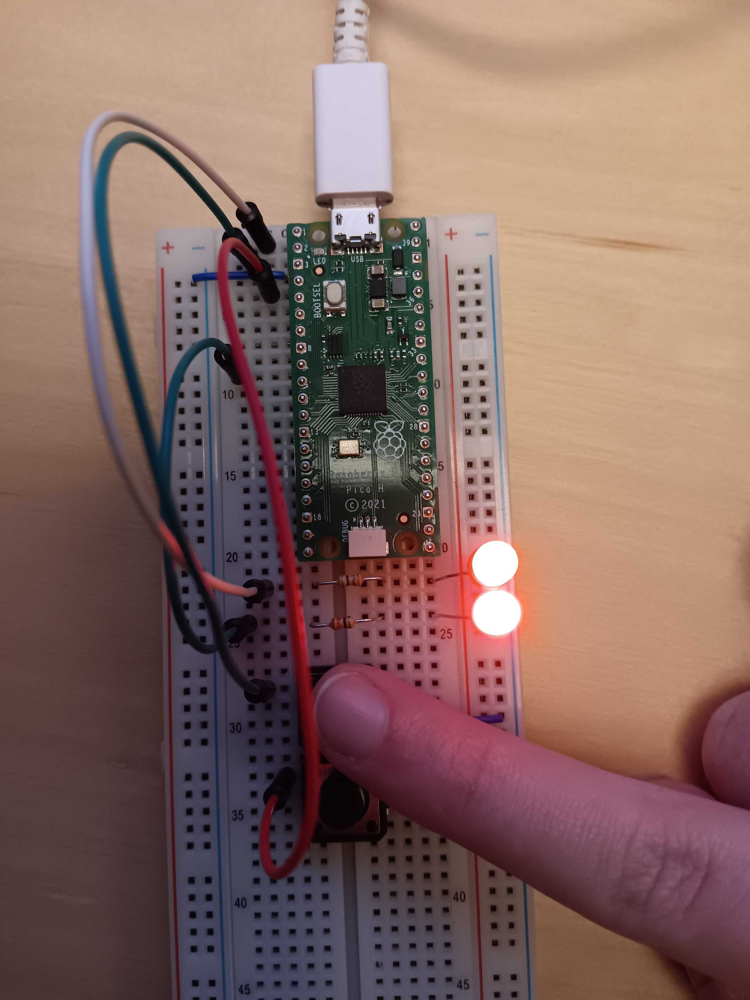
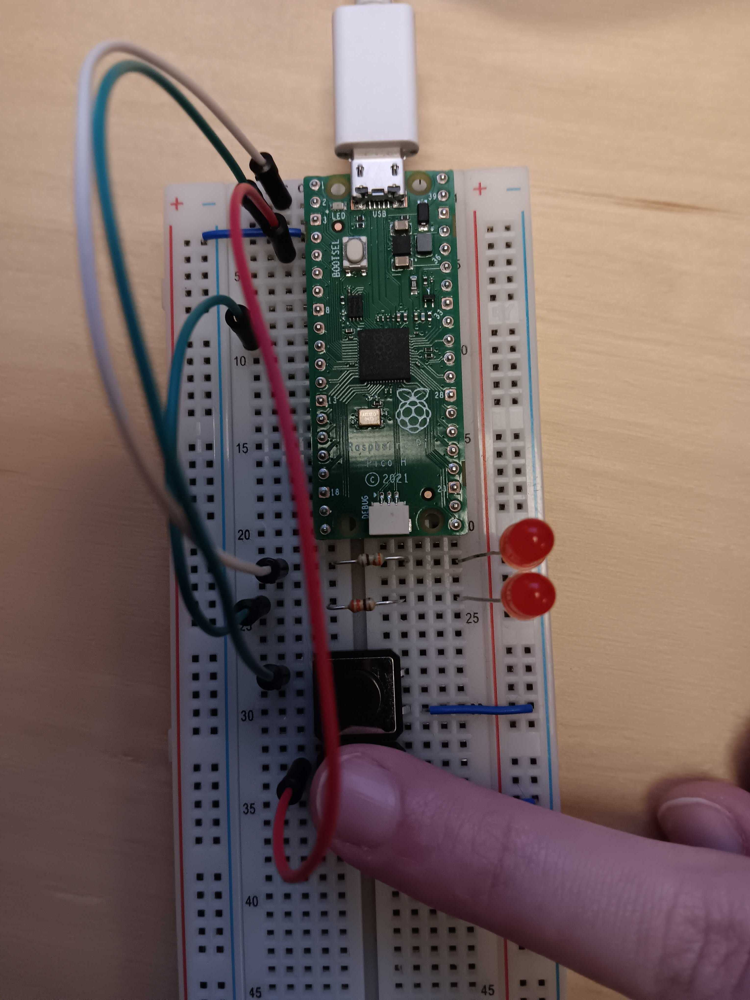

# 1DT301 Lab Assignment 4 - C-programming and interrupts
*Computer Technology 1* \
*October 22, 2025*

Author: Michelle Weber, Sanja Janevska\
Examiner: Mehdi Saman Azari\
Semester: HT25\
Discipline: NGDNS, NGDPV

# Tasks

# Task 1
Use the same setup as in Lab3 Tasks 4 and 5, that is, an LED connected to GP0 and buttons connected to GP1 and GP2. Use button on GP1 to turn on LED, button on GP2 to turn it off.

# Task 1a
Write a C program to implement the functions. To read buttons and
control LED, use the C function gpio_put(…) and gpio_get().

## Explanation Code
The code is one function. First, we declare the 3 constants needed for the program. Just like in assembly.\
The constants will be LED1, which is 0 for GPIO0, BTN1, which is 1 for GPIO1 and BTN2, which is 2 for GPIO2.

After the constants are declared, we move to the main function.\
The function first initializes all GPIO pins that are used. The LED is initialized with gpio_init to initialize it and then gpio_set_dir to set the direction, which in this case, is GPIO_OUT. This is a variable that will be imported in the #include section.\
The 2 buttons are declared using gpio_init and gpio_set_dir just like the LED, only that the second value for the gpio_set_dir function is this time GPIO_IN, since the buttons are input, so we need to set the pins that the buttons are connected to, to input. We also need to activate the pull up resistors. This will be done by using gpio_pull_up. This process will be done for both buttons respectively.\
These functions are all imported using #include at the top of the program.

Next, there is an endless loop (while(true)..). This loop will continuosly check both input pins for a signal comming from the buttons, by using gpio_get with a button as input. We check both buttons like this and compare them with 0. Because 0 means that a button is pressed.\
If button 1 is pressed, the first if condition is met and it will then execute gpio_put with value 1 for the LED. That means the LED is now on.\
If button 2 is pressed, the second if condition is me and it will then execute the gpio_put with value 0 for the LED. That means the LED is now turned off.\
As already mentioned, the while-loop will go infinite amounts of times.

## Execution
When the build file has been made and "cmake .." and "make" has been successfully executed inside the build file, you hold down the BOOTSEL button while plugging the pico into your device. Then, load the file onto the pico with "sudo picotool load ButtonSDK.uf2" and then force-restart the pico with "sudo picotool reboot -f". It will then remove the pico as a data drive in your device and execute the program on the pico.\
If you now press the first button, the LED should light up (see image below).\
\
If you then press the second button, the LED should turn off (see image below).\

**Note:** This explanation of the commands was based on the Raspberry Pi 3 Model B V1.2 and *NOT* the virtual machine. However, the Raspberry had a similar OS than the VM. The Raspberry uses Bullseye 32-bit, so the commands *should* be the same (not tested).

## Sourcecode files
[ButtonSDK.c](../ass4/task1/a/ButtonSDK.c)\
[CMakeLists.txt](../ass4/task1/a/CMakeLists.txt)\
[pico_sdk_import.cmake](../ass4/task1/a/pico_sdk_import.cmake)\
[ButtonSDK.uf2](../ass4/task1/a/build/ButtonSDK.uf2)

To get to the whole Task 1a directory instead, click [here](../ass4/task1/a/).

# Task 1b
Re-write the C program so that is does not use the gpio functions, but instead hardware addresses of the SIO. However, you ARE allowed to use C functions to initialize the GPIO pins and set their directions!

## Explanation Code
This is code is an expantion of task 1a.\
This time, the code uses none of the gpio functions to turn the LED on or off or to read button inputs. Instead the program uses the hardware addresses of the SIO. However, the task allowes us to use the C functions to initialize the GPIO pins and set their directions. So, this part is identical to the task 1a.

On top we declare a volatile 32-bit unassigned integer, that is the SIO_BASE (gpiobase from assignment 3). This address is volatile because it's changing over the time of the program running, but it will be used for the whole program, so assigning it globally is much more efficient.

Instead of the gpio_put and gpio_get functions, the program uses helper functions that will be used in the main function's loop to read input and turn the LED on or off. The main loop's logic from task 1a still remains and the while-loop still will loop endlessly.\
The helper function gpioget takes an input pin as input. It then loads the SIO address combined with the SIO_GPIO_IN_OFFSET onto the gpioin variable. Next, the gpioin gets shifted to the input pin value. This result gets stored in the variable shifted_to_pin. Lastly, the program zero's out all non relevant values (pins), so we only have the bit value for the input pin. This result gets then returned.\
The helper function turnOn takes an output pin as input. It then shifts value 1 to the output pin value position. This is the bitmask of the pin. The bitmask gets then written onto the 'set output' register using the SIO_BASE address combined with the SIO_GPIO_OUT_SET_OFFSET. This basically turns the output pin to HIGH, or in this case: the LED on.\
The helper function turnOff takes an output pin as input. It then shifts value 1 to the output pin value position. This is the bitmask of the pin. The bitmask gets then written onto the 'clear output' register using the SIO_BASE address combined with the SIO_GPIO_OUT_CLR_OFFSET. This basically turns the output pin to LOW, or in this case: the LED off.

## Execution
Same execution as task 1a.\
When the build file has been made and "cmake .." and "make" has been successfully executed inside the build file, you hold down the BOOTSEL button while plugging the pico into your device. Then, load the file onto the pico with "sudo picotool load ButtonSDK.uf2" and then force-restart the pico with "sudo picotool reboot -f". It will then remove the pico as a data drive in your device and execute the program on the pico.\
If you now press the first button, the LED should light up (see image below).\
\
If you then press the second button, the LED should turn off (see image below).\

**Note:** This explanation of the commands was based on the Raspberry Pi 3 Model B V1.2 and *NOT* the virtual machine. However, the Raspberry had a similar OS than the VM. The Raspberry uses Bullseye 32-bit, so the commands *should* be the same (not tested).

## Sourcecode files
[ButtonSDK.c](../ass4/task1/b/ButtonSDK.c)\
[CMakeLists.txt](../ass4/task1/b/CMakeLists.txt)\
[pico_sdk_import.cmake](../ass4/task1/b/pico_sdk_import.cmake)\
[ButtonSDK.uf2](../ass4/task1/b/build/ButtonSDK.uf2)

To get to the whole Task 1b directory instead, click [here](../ass4/task1/b/).

# Task 1c
Connect one more LED to GP6. Extend the program from b) so that it turns on or off both LEDs simultaneously.

## Explanation Code
// TODO: Explanation of Code

## Execution
Same execution as task 1a and 1b but this time with 2 LEDs.\
When the build file has been made and "cmake .." and "make" has been successfully executed inside the build file, you hold down the BOOTSEL button while plugging the pico into your device. Then, load the file onto the pico with "sudo picotool load ButtonSDK.uf2" and then force-restart the pico with "sudo picotool reboot -f". It will then remove the pico as a data drive in your device and execute the program on the pico.\
If you now press the first button, the LEDs should light up (see image below).\
\
If you then press the second button, the LEDs should turn off (see image below).\

**Note:** This explanation of the commands was based on the Raspberry Pi 3 Model B V1.2 and *NOT* the virtual machine. However, the Raspberry had a similar OS than the VM. The Raspberry uses Bullseye 32-bit, so the commands *should* be the same (not tested).

## Sourcecode files
[foo.S](../ass4/task1/c/foo.S)\
[CMakeLists.txt](../ass4/task1/c/CMakeLists.txt)\
[pico_sdk_import.cmake](../ass4/task1/c/pico_sdk_import.cmake)\
[foo.uf2](../ass4/task1/build/c/foo.uf2)

To get to the whole Task 1c directory instead, click [here](../ass4/task1/c/).

# Task 2
Connect four LEDs in a row to make a binary counter. The counter should count from 0000 to 1111.\
The LEDs should be connected to ports GP1, GP2, GP3 and GP4.\
Connect one button to GP5 and one button to GP6 with the following functions:
- Let the button on GP5 increment the counter (increase one step). If increase button is pressed when counter value is 15, nothing should happen!
- Let the button on GP6 decrement the counter (decrease one step). If decrease button is pressed when counter value is 0, nothing should happen!

Let the counter start at value 0. You must use interrupts to handle the inputs from the buttons! There will probably be problems with bouncing buttons (one button press counts as many) but you can ignore this problem.

## Explanation Code
// TODO: explain code

## Hardware - Layout

### Electric Circuit Plan
Note: The application didn't have Pico H, so I used the normal Pico instead. Pin connection should still be correct **where it was used**.\

## Execution
// TODO

**Note:** This explanation of the commands was based on the Raspberry Pi 3 Model B V1.2 and *NOT* the virtual machine. However, the Raspberry had a similar OS than the VM. The Raspberry uses Bullseye 32-bit, so the commands *should* be the same (not tested).

## Sourcecode files
[foo.S](../ass4/task2/foo.S)\
[CMakeLists.txt](../ass4/task2/CMakeLists.txt)\
[pico_sdk_import.cmake](../ass4/task2/pico_sdk_import.cmake)\
[foo.uf2](../ass4/task2/build/foo.uf2)

To get to the whole Task 2 directory instead, click [here](../ass4/task2/).

# Task 3
Use the same counter setup as in the previos task, but this time, let the counter increase automatically using a timer interrupt. Also, connect a button to GP0 to reset the counter. You don’t need to use the buttons at GP5 and GP6 in this task.\
Requirements:
- There should be 1 second time interval between the counter values.
- Stop the count when the counter reaches its maximum value 1111.
- At any time, the Reset button should reset the counter to 0000 and after that, the counter shall resume its counting.
- The counting must be implemented with a timer interrupt and you must use GPIO interrupts to handle the signals from the buttons!

## Explanation Code
// TODO: explain code

## Hardware Layout
The hardware layout is the same as Task 2.\

### Electric Circuit Plan
Note: The application didn't have Pico H, so I used the normal Pico instead. Pin connection should still be correct **where it was used**.\
(same as task 2)\

## Execution
// TODO

**Note:** This explanation of the commands was based on the Raspberry Pi 3 Model B V1.2 and *NOT* the virtual machine. However, the Raspberry had a similar OS than the VM. The Raspberry uses Bullseye 32-bit, so the commands *should* be the same (not tested).

## Sourcecode files
// TODO: edit file directory
[foo.S](../ass4/task3/foo.S)\
[CMakeLists.txt](../ass4/task3/CMakeLists.txt)\
[pico_sdk_import.cmake](../ass4/task3/pico_sdk_import.cmake)\
[foo.uf2](../ass4/task3/build/foo.uf2)

To get to the whole Task 3 directory instead, click [here](../ass4/task3/).

---
# Sources
## Images that weren't taken by ourselves
foo

## Pico Pinout
https://pico2.pinout.xyz/ \
https://datasheets.raspberrypi.com/pico/Pico-R3-A4-Pinout.pdf

## Pico Instructions
https://developer.arm.com/documentation/dui0473/m/arm-and-thumb-instructions/arm-and-thumb-instruction-summary \
https://github.com/Apress/RP2040-Assembly-Language-Programming/tree/main \
https://datasheets.raspberrypi.com/pico/getting-started-with-pico.pdf

## C coding
https://stackoverflow.com/questions/55330597/how-do-i-execute-a-c-file \
https://www.geeksforgeeks.org/c/c-switch-statement/ \
https://www.youtube.com/watch?v=ciio80nkjB8&list=WL&index=12&t=240s

## For general studying / Other
https://www.raspberrypi.com/documentation/computers/getting-started.html \
https://www.raspberrypi.com/documentation/microcontrollers/c_sdk.html \
https://studio2.org.uk/jack/RP2040%20Assembly%20Language%20Programming%20%28Smith%29.pdf \
https://projects.raspberrypi.org/en/projects/getting-started-with-the-pico \
https://www.circuit-diagram.org/editor/
