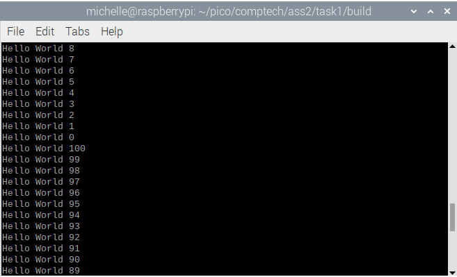

# 1DT301 Lab Assignment 3
*Computer Technology 1* \
*October 8, 2025*

Author: Michelle Weber, Sanja Janevska\
Examiner: Mehdi Saman Azari\
Semester: HT25\
Discipline: NGDNS, NGDPV

# Tasks

# Task 1
// TODO

## Explanation Code
For this task, minicom was used to display the output. In this task we needed to write a program that calculates the average value of 8 numbers already defined in the .data section. 
So we have two similar but slightly different solutions and we explain both of them next.
In the first solution (Michelle's), the program continuously reads two buttons and sets two LEDs accordingly. It first initialized the GPIO pins for the LEDs and the buttons setting the LEDs as outputs and the buttons as inputs with internal pull-up resistors. It then in an infinite loop checks the state of BUTTON1 and BUTTON2 using link_gpio_get.
If BUTTON1 is pressed it turns on both LEDs by calling link_gpio_put_all with a value of 1, and if BUTTON2 is pressed it turns the LEDs off by calling the same function with 0. The program then cycles between checking each button and updating the LEDs.

In the second solution (Sanja's), our program begins by initializing the standard stdio_init_all to enable the printing and then enters a loop where it loads the array address into R0 and the number of elements into R1 before calling the average subroutine.
In the average subroutine registers R4-R7 were used to temporarily hold and sum the array elements, adding four elements at a time and then one more time just one element (re-using the registers) and then it stored the total sum in R0 and divided by 8 by using logical shift right (LSR). 
After that the program moves the average value into R1, loads the address of the format string into R0 and calls printf to display the message. The program then loops forever.

## Execution
// TODO
The program can be visible by using minicom. When the build file has been made and "cmake .." and "make" has been successfully executed inside the build file, you load the file onto the pico with "sudo picotool load HelloWorld.uf2" and then force-restart the pico with "sudo picotool reboot -f". It will then remove the pico as a data drive in your device and execute the program on the pico. Use the command "minicom -b 115200 -o -D /dev/ttyACM0" to open minicom and see the program's output.\
// TODO CHANGE IMAGE \
\
This whole program will loop forever, until you unplug the pico or press Ctrl A and then Z for help and choose X for "reset and exit".\
**Note:** This explanation of the commands was based on the Raspberry Pi 3 Model B V1.2 and *NOT* the virtual machine. However, the Raspberry had a similar OS than the VM. The Raspberry uses Bullseye 32-bit, so the commands *should* be the same (not tested).

## Sourcecode files
// TODO

To get to the whole Task 1 directory instead, click [here](../ass3/task1/).

# Task 2
// TODO

## Explanation Code
// TODO

## Hardware - Layout
// TODO

### Electric Circuit Plan
Note: The application didn't have Pico H, so I used the normal Pico instead. Pin connection should still be correct **where it was used**.\
// TODO

## Execution
// TODO

**Note:** This explanation of the commands was based on the Raspberry Pi 3 Model B V1.2 and *NOT* the virtual machine. However, the Raspberry had a similar OS than the VM. The Raspberry uses Bullseye 32-bit, so the commands *should* be the same (not tested).

## Sourcecode files
// TODO

To get to the whole Task 2 directory instead, click [here](../ass3/task2/).

# Task 3
// TODO

## Explanation Code
// TODO

### The new C function "get_binary" in sdklink.c
// TODO

## Hardware Layout
// TODO

### Electric Circuit Plan
Note: The application didn't have Pico H, so I used the normal Pico instead. Pin connection should still be correct **where it was used**.
// TODO

## Execution
// TODO

**Note:** This explanation of the commands was based on the Raspberry Pi 3 Model B V1.2 and *NOT* the virtual machine. However, the Raspberry had a similar OS than the VM. The Raspberry uses Bullseye 32-bit, so the commands *should* be the same (not tested).

## Sourcecode files
// TODO

To get to the whole Task 3 directory instead, click [here](../ass3/task3/).

# Task 4
// TODO

## Explanation Code
// TODO

## Hardware - Finding out which pins are which - Finding common cathode/anode
// TODO

## Hardware Layout
// TODO

### Electric Circuit Plan
Note: The application didn't have Pico H, so I used the normal Pico instead. Pin connection should still be correct **where it was used**.
// TODO

## Execution
// TODO

**Note:** This explanation of the commands was based on the Raspberry Pi 3 Model B V1.2 and *NOT* the virtual machine. However, the Raspberry had a similar OS than the VM. The Raspberry uses Bullseye 32-bit, so the commands *should* be the same (not tested).

## Sourcecode files
// TODO

To get to the whole Task 4 directory instead, click [here](../ass3/task4/).

---
# Sources
## Images that weren't taken by ourselves

## Pico Pinout
https://pico2.pinout.xyz/ \
https://datasheets.raspberrypi.com/pico/Pico-R3-A4-Pinout.pdf

## Pico Instructions
https://developer.arm.com/documentation/dui0473/m/arm-and-thumb-instructions/arm-and-thumb-instruction-summary \
https://github.com/Apress/RP2040-Assembly-Language-Programming/tree/main \
https://datasheets.raspberrypi.com/pico/getting-started-with-pico.pdf

## C coding
https://stackoverflow.com/questions/55330597/how-do-i-execute-a-c-file \
https://www.geeksforgeeks.org/c/c-switch-statement/ \
https://www.youtube.com/watch?v=ciio80nkjB8&list=WL&index=12&t=240s

## For general studying / Other
https://www.raspberrypi.com/documentation/computers/getting-started.html \
https://www.raspberrypi.com/documentation/microcontrollers/c_sdk.html \
https://studio2.org.uk/jack/RP2040%20Assembly%20Language%20Programming%20%28Smith%29.pdf \
https://projects.raspberrypi.org/en/projects/getting-started-with-the-pico \
https://www.circuit-diagram.org/editor/
